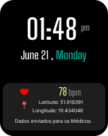
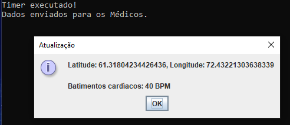

<a name="readme"></a>

<!-- LOGO DO PROJETO -->
<br />
<div align="center">
    
  <h3 align="center">Projeto SmartWatch</h3>
</div>

<!-- Sobre o Projeto -->
## Sobre o Projeto

<div align="center">

</div>
 
O nosso projeto seria um aplicativo de smartwatch que monitora os batimentos cardíacos e a localização do usuário. Ele é executado a cada minuto e exibe uma mensagem com os dados atualizados. Se os batimentos cardíacos estiverem fora da faixa normal, o aplicativo chamará a ajuda e enviará os dados para os responsáveis.


<!-- Requisitos -->
## Requisitos
Principais estruturas/bibliotecas usadas para inicializar o projeto. 

* Java 11 ou superior
* IDE Java (como IntelliJ IDEA ou Eclipse)


<!-- Instalação -->
## Instalação

* Clone o repositório do GitHub:
  ```
  git clone https://github.com/GuMilano/Projeto-Smartwatch/SmartWatchApp.git
  ``` 

* Abra o projeto no IDE Java.

* Execute o aplicativo:
  ``` 
  mvn clean install
  java -jar target/smartwatchapp-1.0.jar 
  ``` 

## Funcionalidades
* Monitoramento dos batimentos cardíacos
* Monitoramento da localização
* Notificação de batimentos cardíacos fora da faixa normal
* Chamada de ajuda
* Envio de dados para os responsáveis

## Exemplo de saída

Caso os batimentos estiverem dentro dos conformes, mostrará a seguinte saída:
  *  
  ```
  Atualização
  Latitude: 45.5, Longitude: -73.5
  Batimentos cardíacos: 70 BPM
  ```


Caso os batimentos estiverem fora da faixa normal, mostrará a seguinte saída:

  ```
  Atualização
  Latitude: 45.5, Longitude: -73.5
  Batimentos cardíacos: 150 BPM
  BATIMENTOS CARDÍACOS ELEVADOS!
  Chamando Ajuda para João
  ```


